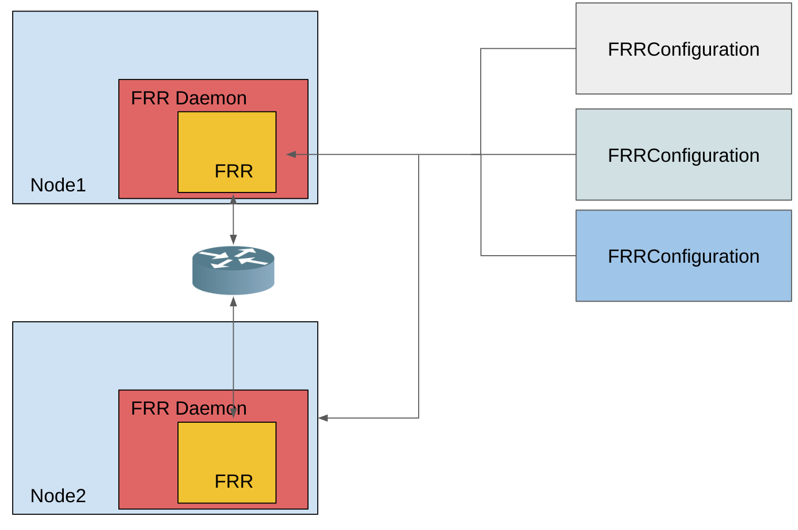

# FRR-k8s


A kubernetes based daemonset that exposes a subset of the FRR API in a kubernetes compliant manner.

The rationale behind the creation of this project is to allow multiple actors to share a single FRR instance
running on kubernetes nodes. More details can be found in the [metallb design proposal](https://github.com/metallb/metallb/blob/main/design/splitfrr-proposal.md).

## Description

FRR-K8s is deployed as a daemonset on Kubernetes clusters' nodes.

Each FRR-K8s pod embeds an instance of [FRR](https://frrouting.org/).

The `FRRConfiguration` CRD is the way a cluster administrator can configure each `frr-k8s` instance running on the various nodes.

Each instance will collect all the `FRRConfiguration`s applied to the node it's running on, will merge them and produce the
corresponding FRR configuration.

Additionally, each `frr-k8s` instance will produce a `FRRNodeState` instance exposing the status of the FRR
instance running on each node.



## Installing

The frr-k8s daemon provides 3 deployment methods.

### All in one manifests

This is the simplest way to deploy and test frr-k8s, although the least configurable one.

```bash
kubectl apply -f https://raw.githubusercontent.com/metallb/frr-k8s/main/config/all-in-one/frr-k8s.yaml
```

Note: there is also a `frr-k8s-prometheus.yaml` variant which contains the opinionated configuration of metrics
for prometheus deployed via the [kube-prometheus](https://github.com/prometheus-operator/kube-prometheus) repository.

This is intended mostly for testing purpouses.

### Kustomize

You can install FRR-K8s with [Kustomize](https://kustomize.io/) by pointing at the remote kustomization file.

```yaml
# kustomization.yml
namespace: frr-k8s-system

resources:
  - github.com/metallb/frr-k8s/config/frr-k8s?ref=main
```

### Helm

You can install FRR-K8s with [Helm](https://helm.sh/) by using the Helm chart repository: `https://metallb.github.io/frr-k8s`:

```bash
helm repo add frr-k8s https://metallb.github.io/frr-k8s
helm install frr-k8s frr-k8s/frr-k8s
```

A values file may be specified on installation. This is recommended for providing configs in Helm values:

```bash
helm install frr-k8s frr-k8s/frr-k8s -f values.yaml
```

**NOTE:** The frr-k8s pod requires elevated permission in order to perform its network functionalities.

If you are using frr-k8s with a kubernetes version that enforces pod security admission (which is beta in k8s 1.23), the namespace frr-k8s is deployed to must be labelled with:

```yaml
  labels:
    pod-security.kubernetes.io/enforce: privileged
    pod-security.kubernetes.io/audit: privileged
    pod-security.kubernetes.io/warn: privileged
```

## Configuring FRR-K8s

The CRD to configure `FRR-K8s` is the `FRRConfiguration`. A comprehensive documentation of the API can be found in
the [API Docs file](./API-DOCS.md)

### BGP Configuration

The `BGP` section of the FRRConfiguration spec is in charge of configuring the details related to the BGP protocol.

#### Configuring one (or multiple) routers

It is possible to configure multiple routers, one for each VRF.

For each router, you can define the ASN and the VRF it belongs to, plus a list of prefixes to announce
and a list of BGP neighbors to connect to:

```yaml
spec:
  bgp:
    routers:
    - asn: 64512
      neighbors:
      - address: 172.30.0.3
        asn: 4200000000
        ebgpMultiHop: true
        port: 180
      - address: 172.18.0.6
        asn: 4200000000
        port: 179
```

#### Advertising a prefix to a given neighbor

By default, the prefixes configured as part of a router configuration are not advertised. In order to advertise them,
the `toAdvertise` section must be filled.

A subset of the prefixes can be advertised:

```yaml
spec:
  bgp:
    routers:
    - asn: 64512
      neighbors:
      - address: 172.30.0.3
        asn: 4200000000
        ebgpMultiHop: true
        port: 180
        toAdvertise:
          allowed:
            prefixes:
            - 192.168.2.0/24
      prefixes:
        - 192.168.2.0/24
        - 192.169.2.0/24
```

or all the prefixes configured in the router can be advertised:

```yaml
spec:
  bgp:
    routers:
    - asn: 64512
      neighbors:
      - address: 172.30.0.3
        asn: 4200000000
        ebgpMultiHop: true
        port: 180
        toAdvertise:
          allowed:
            mode: all
      prefixes:
        - 192.168.2.0/24
        - 192.169.2.0/24
```

#### Receiving prefixes from a given neighbor

By default, no prefixes advertised by a neighbor are processed.

In order to process them, a `toReceive` section must be filled.

A subset of the prefixes can be received:

```yaml
spec:
  bgp:
    routers:
    - asn: 64512
      neighbors:
      - address: 172.18.0.5
          asn: 64512
          port: 179
          toReceive:
            allowed:
              prefixes:
              - prefix: 192.168.1.0/24
              - prefix: 192.169.2.0/24
                ge: 25
                le: 28
```

le / ge specify prefix length. The prefix will be applied if the prefix length is less than or equal to the le prefix length
and greater than or equal the ge prefix length.

FRR can be configured to handle all the prefixes announced:

```yaml
spec:
  bgp:
    routers:
    - asn: 64512
      neighbors:
      - address: 172.18.0.5
          asn: 64512
          port: 179
          toReceive:
            allowed:
              mode: all
```

### Adding a raw configuration

In order to facilitate experimentation and to fill gaps quickly, it is possible to set a piece of raw
FRR configuration that is appended to the rendered one. In order to do so, the `rawConfig` field
must be set:

```yaml
apiVersion: frrk8s.metallb.io/v1beta1
kind: FRRConfiguration
metadata:
  name: test1
  namespace: frr-k8s-system
spec:
  raw:
    priority: 5
    rawConfig: |-
      router bgp 64512
        neighbor 172.18.0.5 remote-as 4200000000
        neighbor 172.18.0.5 timers 0 0
        neighbor 172.18.0.5 port 179
```

The priority field sets the order in case multiple configurations are merged together.

#### Associating a neighbor with BFD

It is possible to define various BFD profiles (in the `bgp` section of the spec) and associate them to a neighbor.
By doing so, the BGP session is backed up by BFD and thus FRR is able to detect link failures quickly.

```yaml
spec:
  bgp:
    routers:
    - asn: 64512
      neighbors:
      - address: 172.30.0.3
        asn: 64512
        port: 180
        bfdProfile: defaultprofile
    bfdProfiles:
      - name: defaultprofile
```

### Node selector

A node selector field drives the nodes where the given configuration is applied.

```yaml
apiVersion: frrk8s.metallb.io/v1beta1
kind: FRRConfiguration
metadata:
  name: test
  namespace: frr-k8s-system
spec:
  bgp:
    routers:
    - asn: 64512
  nodeSelector:
    labelSelector:
      foo: "bar"
```

By not setting the node selector the configuration is applied to all nodes where the daemon is running.

### How multiple configurations are merged together

Multiple actors may add configurations selecting the same node. In this case, the configurations are merged together.

The way `frr-k8s` configurability is intended is, each configuration can only extend others. This means that it is
allowed (and possible) to add a new neighbor to a router, or to advertise an additional prefix to a neighbor, but there
is no way to remove a component added by another configuration.

#### Configuration conflicts

There are configurations that may conflict between themselves, leading to errors.

This includes for example:

- different ASN for the same router (in the same VRF)
- different ASN for the same neighbor (with the same ip / port)
- multiple BFD profiles with the same name but different values

When the daemon finds an invalid configuration state of a given node, it will report the configuration as invalid and it will
leave the previous valid FRR configuration.

#### Merging

If the configurations to be applied to a given node are compatible, merging works by:

- combining all the routers
- for each router, merging all the prefixes and the neighbors
- for each neighbor, merging all the filters*

\*: a more permissive filter has precedence over a less permissive one, so accepting some prefixes has precedence over
not accepting any, and accepting all the prefixes has precedence over accepting some.

By doing so, it is possible to:

- Extend the set of ips we want to advertise to a given neighbor
- Adding an extra neighbor with its set of IPs
- Extend the set of ips we want to associate a given community to
- Allow incoming routes for a given neighbor

**Each configuration must be self contained!** This means for example that it's not possible to allow prefixes that are not defined in the router section, leveraging prefixes coming from another configuration.

## Checking the status of each FRR instance

The `FRRNodeState` resource exposes the status of the FRR instance running on each node.

This includes:

- `runningConfig`: the current FRR running config, which is the configuration the FRR instance is currently running with.
- `lastReloadResult`: the status of the last configuration update operation by FRR, contains "success" or an error.
- `lastConversionResult`: the status of the last translation between the `FRRConfiguration`s resources and FRR's configuration, contains "success" or an error.

## Blocking prefixes that may break the cluster

The controller accepts a --always-block parameter that accepts a list of comma separated cidrs. When enabled, FRR-K8s will instruct the FRR instance to always refuse those prefixes. It is useful to reject prefixes that might harm the cluster, overriding routes to ClusterIPs or the IPs of the Pods.

## MetalLB Integration

This project was created as a solution to allow users to leverage the same FRR instance used by MetalLB.

Because of this, we plan to integrate MetalLB so that FRR-K8s can be a BGP backend that can be choosen (as native / frr are
today).

## Exposing new FRR features

The subset of features currently exposed via the API are (mostly) those required by MetalLB to work. If you are interested to contribute a new feature, please file an [issue](https://github.com/metallb/frr-k8s/issues) first, which may turn into a request
for a design proposal.

Please remember the spirit of the `incremental` configuration approach where each new configuration can only extend the existing
one and not remove any parts out of it.

## License

Copyright 2023.

Licensed under the Apache License, Version 2.0 (the "License");
you may not use this file except in compliance with the License.
You may obtain a copy of the License at

    http://www.apache.org/licenses/LICENSE-2.0

Unless required by applicable law or agreed to in writing, software
distributed under the License is distributed on an "AS IS" BASIS,
WITHOUT WARRANTIES OR CONDITIONS OF ANY KIND, either express or implied.
See the License for the specific language governing permissions and
limitations under the License.
